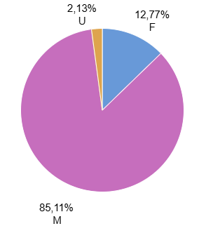

# Jojo's Bizzare Project


## Introduction

Among the stories with which I have most connected, the Jojo's Bizarre Adventure (1987) franchise holds a dear place in my heart. With its sense of humor, pacing, action, characters, and world, this anthology anime has taken me as a viewer from laughter, tears, and glory in the blink of an eye.

<div align="center">
  
</div>

Within its worldbuilding, "Stands," introduced in Part 3 of the series (1989), are the magic/power system that the characters, whether heroes or villains, preferentially possess. These beings are defined as "physical manifestations of a person's life energy" (the Stand user). They have diverse appearances, but are still categorized into 5 types: Natural Humanoid (NH), Artificial Humanoid (AH), Natural Non-Humanoid (NNH), Artificial Non-Humanoid (ANH), and Phenomenon (PH).

<div align="center">

</div>

Furthermore, their abilities are reflected in superpowers as varied as the brilliant mind of their author allows, but in turn, these can be summarized into 6 conventional parameters: Destructive Power (PWR), Speed (SPD), Range (RNG), Stamina (STA), Perception (PRC), Development Potential (DEV).

In this way, and in light of the more than 30 years that the franchise has existed, I asked myself:
**Are there patterns in the design of the stands in terms of their abilities?**

## Objectives

* Develop a clean, homogeneous, and processable database on the stands.
* Describe the profiles of the variables within the database.
* Determine if there are significant correlations and differences in the statistics of the stands in relation to:
    * Season (P3, P4, P5, P6, P7, and P8).
    * User Gender (Masculine, Feminine, Unidentified).
    * User Affiliation (Ally, Antagonist, Neutral).
    * Stand Form (NH, AH, NNH, ANH, PH).

## Questions

* What is the distribution of Stands throughout the different parts of Jojo's?
* Is there any trend in the power levels of the Stands throughout the seasons?
* Is there any Stand form that is more common among certain types of users (e.g., allies vs. antagonists)?
* Is there any correlation between the statistics?

## Tools and Resources

* Microsoft Excel and Google Sheets
* SQL in Big Query
* R Studio in Posit Cloud

## Database

First, I downloaded a database of the stands with official statistics to date from [Kaggle.com](https://www.kaggle.com/). It contains 156 records. Then, using the Wikis "JoJo's Bizarre Encyclopedia" and "JOJOPEDIA," I loaded variables such as the season where the Stand was shown (series\_part), user gender (user\_gender), user affiliation (user\_affiliation), and stand form (stand\_form).


## Cleaning and Transformation

I encountered the particular challenge of encoding the ability levels and transforming them from ratings to numerical values.

Ability levels are typically rated using letters from "E" to "A," but there are exceptions under the categories of "None" and "Infinite." This latter value makes it difficult to transform the ordinal level of measurement to a metric/ratio level of measurement for obvious reasons.

For this reason and others, I decided to exclude some cases from the final database.

### Inclusion Criteria

Only the following were added:

* Stands with official statistics.
* Belonging to the main series, not novels, one-shots, etc.
* Stands exclusively with statistics: A, B, C, D, E, and None. Those with "Infinite" level statistics are not included because they cannot be transformed into numerical values.
* Repeated Stands, as their statistical expression varies according to the series\_part, technically making them distinct Stands.


## Analysis and Results

### Descriptive Statistics

For a total of 141 records, I performed the transformation of the ability statistics columns, converting the values from "None" (0) to "A" (5). I used SQL in the Big Query console as well as Google Sheets to assign the new statistical values using VLOOKUP as tools. I also used Tableau to graph the resulting tables.

<details>
    <summary>Show SQL</summary>

```sql
SELECT
  stand_name,
  CASE PWR
    WHEN 'None' THEN 0
    WHEN 'E' THEN 1
    WHEN 'D' THEN 2
    WHEN 'C' THEN 3
    WHEN 'B' THEN 4
    WHEN 'A' THEN 5
    ELSE NULL
  END AS PWR,
  CASE SPD
    WHEN 'None' THEN 0
    WHEN 'E' THEN 1
    WHEN 'D' THEN 2
    WHEN 'C' THEN 3
    WHEN 'B' THEN 4
    WHEN 'A' THEN 5
    ELSE NULL
  END AS SPD,
  CASE RNG
    WHEN 'None' THEN 0
    WHEN 'E' THEN 1
    WHEN 'D' THEN 2
    WHEN 'C' THEN 3
    WHEN 'B' THEN 4
    WHEN 'A' THEN 5
    ELSE NULL
  END AS RNG,
  CASE STA
    WHEN 'None' THEN 0
    WHEN 'E' THEN 1
    WHEN 'D' THEN 2
    WHEN 'C' THEN 3
    WHEN 'B' THEN 4
    WHEN 'A' THEN 5
    ELSE NULL
  END AS STA,
  CASE PRC
    WHEN 'None' THEN 0
    WHEN 'E' THEN 1
    WHEN 'D' THEN 2
    WHEN 'C' THEN 3
    WHEN 'B' THEN 4
    WHEN 'A' THEN 5
    ELSE NULL
  END AS PRC,
  CASE DEV
    WHEN 'None' THEN 0
    WHEN 'E' THEN 1
    WHEN 'D' THEN 2
    WHEN 'C' THEN 3
    WHEN 'B' THEN 4
    WHEN 'A' THEN 5
    ELSE NULL
  END AS DEV
FROM
  `jojo-project-436213.stands.alpha`
```
</details>


"Similarly, I used SQL to obtain the average of the stands based on the four nominal variables:


1.  **Season**

    (What is the distribution of Stands across the different parts of Jojo's?)

    I found that the part with the fewest Stands by statistics is part 8 (P8: Jojolion, 6.03%), while the part with the most Stands is part 3 (P3: Stardust Crusaders, 28.45%), where the concept was introduced for the first time. There is also a noticeable decreasing trend over the years regarding the inclusion of Stands in the franchise.

    The decision to gradually include fewer Stands may stem from a desire to avoid redundancies with already created Stands or that the story placed greater emphasis on the plot and character subplots.


    <details>
    <summary>Show SQL</summary>

    ```sql
    SELECT
        series_part,
        ROUND(COUNT(series_part) * 100 / (SELECT COUNT(*) FROM `jojo-project-436213.stands.numeric`), 2) AS PercentageFROM
        `jojo-project-436213.stands.numeric`GROUP BY
        series_partORDER BY
        series_part ASC;
    ```

    </details>


2.  **User Gender**

    As expected from a Shonen manga, a substantial percentage of the Stands belong to male characters (M) (85.1%).

    <details>
    <summary>Show SQL</summary>

    ```sql
    SELECT
        user_gender,
        ROUND(COUNT(user_gender) * 100 / (SELECT COUNT(*) FROM `jojo-project-436213.stands.numeric`), 2) AS PercentageFROM
        `jojo-project-436213.stands.numeric`GROUP BY
        user_genderORDER BY
        Percentage DESC;
    ```

    </details>
    


3.  **User Affiliation**

    For similar reasons to the previous point, most Stands are Antagonists (56.0%), followed by Allies (38.3%) of the protagonist, and finally characters with greater ambiguity on the subject (Neutral) (5.7%).

    <details>
    <summary>Show SQL</summary>

    ```sql
    SELECT
        user_affiliation,
        ROUND(COUNT(user_affiliation) * 100 / (SELECT COUNT(*) FROM `jojo-project-436213.stands.numeric`), 2) AS PercentageFROM
        `jojo-project-436213.stands.numeric`GROUP BY
        user_affiliationORDER BY
        Percentage DESC;
    ```

    </details>


4.  **Stand Form**

    <details>
    <summary>Show SQL</summary>

    ```sql
    SELECT
        stand_form,
        ROUND(COUNT(stand_form) * 100 / (SELECT COUNT(*) FROM `jojo-project-436213.stands.numeric`), 2) AS PercentageFROM
        `jojo-project-436213.stands.numeric`GROUP BY
        stand_formORDER BY
        Percentage DESC;
    ```
    </details>


   
   There is a predominance of Stands with the form of Artificial Human (AH) (28.4%). Meanwhile, Stands with the form of Phenomena (PH) are the least frequent (12.8%).
   This design decision may stem from the fact that humanoid Stands (Artificial or Natural) can be more appealing and relatable to the viewer, and conversely, the opposite may be true for phenomenon-type Stands.

## **Relationships**

* **Stats and Season**

   (Is there a trend in the skill levels of the Stands across the seasons?)

  The results, as shown in the graphs and summarized in the table, suggest that the highest averages for each statistic are distributed among parts 4, 5, and 6 as follows:
  * The Stands from part 4 have the highest Stamina and Development Potential on average.
  * Part 5 has the highest average levels of Power and Speed.
  * In part 6, the Stands have the highest average Range and Perception.

      
      
 
  

* **Form and Affiliation**

   Is there a Stand form that is more common among certain types of users (e.g., allies vs. antagonists)?

  It was found that Antagonist Stands tend to have an Artificial Humanoid form (15.60% of the total) more than other forms. A similar trend occurs with Ally Stands, which predominantly have an Artificial Humanoid form (9.93% of the total), although they also present Natural Humanoid forms at the same frequency (9.93%).


* **Correlations Between Stats**

   Is there any correlation between the stats?

  Investigating whether there are stats that tend to occur together, I first analyzed if the distribution of the stats was normal, which would not be expected for non-natural but manufactured data. It was not.
  


   In terms of significant correlations, I found the following:

 * Stands with high levels of Power tend to have high levels of Speed and Development Potential.
 * High levels of Speed and Development Potential also tend to occur together.
 * Stands with higher levels of Development Potential also tend to have high levels in Perception.
    


## **Recommendations**

It was considered to add the variable "stand\_ability." It is recommended to load such information to improve the database.

## **References**

1. [Kaggle Jojo´s Dataset](https://www.kaggle.com/datasets/dsfelix/jojo-stands-stats/data?select=jojo-stands.csv)

2. [JoJo Wiki](https://jojowiki.com/JoJo_Wiki)

3. [JoJopedia - Wiki en español de JoJo's Bizarre Adventure](https://jojo.fandom.com/es/wiki/JoJopedia)


